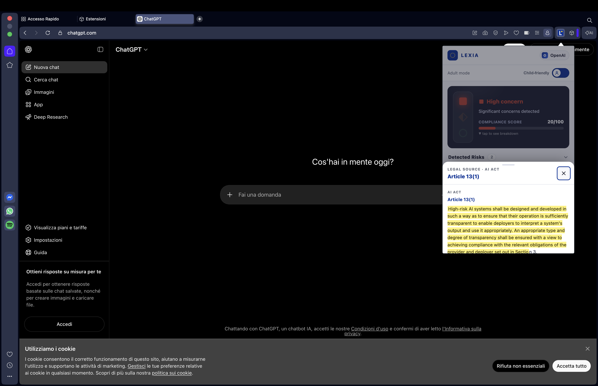

# LEXIA — EU AI Act Rights Checker

LEXIA is a browser extension that checks websites for EU AI Act compliance and explains citizens' rights in plain language. It works like Creative Commons for AI regulation: three layers — machine-readable Knowledge Graph, LLM-powered extraction, and a human-readable popup — all linked by traceable references back to the actual legal text.

The extension reads a platform's Terms of Service, maps it against the EU AI Act (2024/1689) and GDPR (2016/679) using Azure OpenAI, and shows a traffic-light semaphore with per-right and per-risk cards. Every finding links to the exact AKN article paragraph in EUR-Lex. A child-friendly mode simplifies the language for younger users, with Lex the robot mascot guiding them through their rights.

## Architecture


```
Browser Extension (popup.html / popup.js)
        │  chrome.storage.local + auto-notification banner
        │
   background.js  ──── GET /api/site/{domain} ────▶  Flask API (port 5050)
                                                           │
                                          backend/data/platforms/{domain}.json
                                                           │
                                              run_pipeline.py
                                           ┌──────┴──────────────┐
                                     tos_scraper           tos_extractor
                                     (ToSDR corpus /         (Azure OpenAI
                                      web scrape)             o4-mini)
                                           │                     │
                                    wikidata_client        concept_akn_mapping.json
                                    (SPARQL → AIRO)          (10 concept IDs)
                                                           kg_builder.py
                                                      (AKN XML → triples)
                                                           │
                                                  32024R1689.xml (AI Act)
                                                  32016R0679.xml (GDPR)
```

## Demo

<video src="Video Demo.mov" controls width="100%"></video>

## Screenshots

| Adult mode | Child-friendly mode |
|---|---|
|  |  |

## Quick install

> The full step-by-step guide is at [`extension/install.html`](extension/install.html) — open it in your browser.

**1. Set environment variables**

```bash
export AZURE_OPENAI_ENDPOINT="https://<your-resource>.openai.azure.com/"
export AZURE_OPENAI_KEY="<your-api-key>"
```

**2. Install Python dependencies (Python ≥ 3.11)**

```bash
pip install -r requirements.txt
```

**3. Pre-process the 5 platforms**

```bash
python backend/run_pipeline.py
```

Scrapes ToS, calls Azure OpenAI o4-mini, queries Wikidata, computes semaphore scores. Results saved to `backend/data/platforms/`. Skip this step if the JSON files are already present.

**4. Start the API server**

```bash
python backend/api/app.py
```

Runs on `http://localhost:5050`. Keep this terminal open while using the extension.

**5. Load the extension in Chrome / Opera**

1. Go to `chrome://extensions`
2. Enable **Developer mode** (toggle, top-right)
3. Click **Load unpacked**
4. Select the `extension/` folder inside this repo

The LEXIA icon appears in the toolbar. Visit any supported site — a notification slides in automatically on your first visit of the day.

**6. Load the extension in Safari**

```bash
bash extension/convert_to_safari.sh
```

Requires full Xcode. Opens an Xcode project — build it, then enable LEXIA in **Safari → Settings → Extensions**.

## Supported sites

| Platform | Domain | Aliases resolved |
|---|---|---|
| ChatGPT / OpenAI | openai.com | chatgpt.com, chat.openai.com |
| X / Twitter | twitter.com | x.com |
| Klarna | klarna.com | — |
| Claude / Anthropic | anthropic.com | claude.ai, claude.com |
| Facebook / Meta | facebook.com | instagram.com, messenger.com |

## Results

| Platform | Semaphore | Score | Risks detected | AI Act rights granted |
|---|---|---|---|---|
| ChatGPT (openai.com) | 🔴 Red | 20/100 | 2 | 0 / 6 |
| X / Twitter | 🔴 Red | 11/100 | 2 | 0 / 6 |
| Klarna | 🔴 Red | 22/100 | 2 | 0 / 6 |
| Claude (anthropic.com) | 🔴 Red | 0/100 | 3 | 0 / 6 |
| Facebook | 🔴 Red | 35/100 | 1 | 0 / 6 |

All five platforms score red. None explicitly grants EU AI Act rights in its Privacy Policy — the regulation is in force since August 2024 but compliance documentation has not caught up.

## Ontology sources

| Ontology | URI | Use |
|---|---|---|
| AIRO | https://w3id.org/airo | Risk levels, system types |
| DPV EU-AIAct | https://w3id.org/dpv/legal/eu/aiact | System types, roles, compliance |
| DPV EU-Rights | https://w3id.org/dpv/legal/eu/rights | Fundamental rights (CFREU) |
| VAIR | https://w3id.org/vair | Risk vocabulary |
| PrOnto | https://w3id.org/pronto | Rights and obligations icons |

## Legal texts

- **EU AI Act** — Regulation (EU) 2024/1689 — AKN: `32024R1689`
- **GDPR** — Regulation (EU) 2016/679 — AKN: `32016R0679`

EUR-Lex: `https://eur-lex.europa.eu/legal-content/EN/TXT/HTML/?uri=CELEX:`

## License

CC-BY 4.0 International
